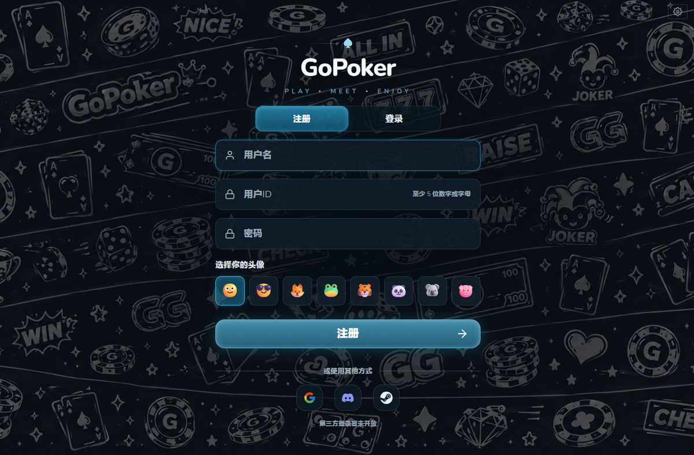
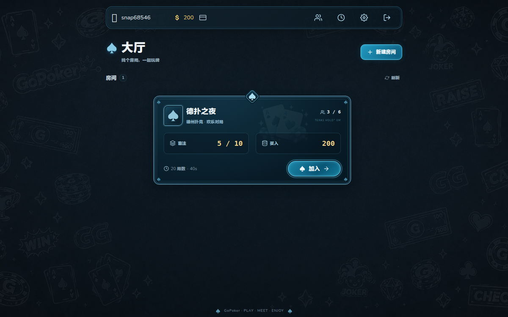
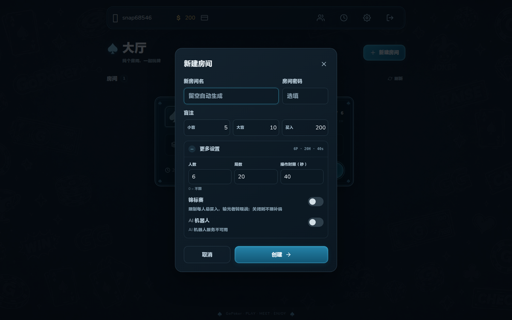
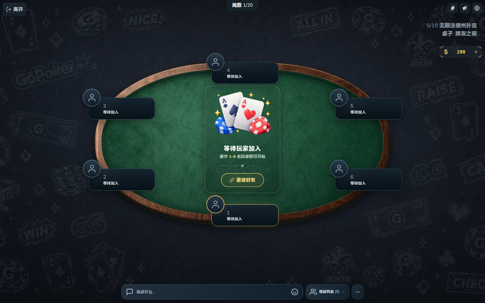
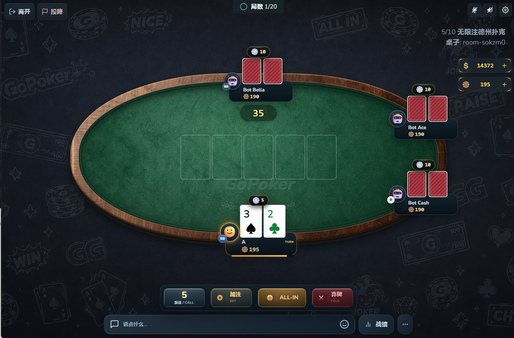
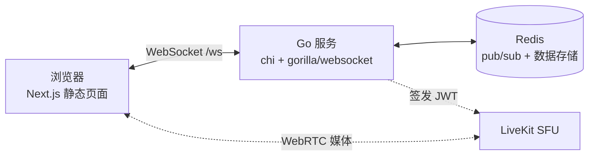

# GoPoker ♠

**多人在线德州扑克** —— Go 后端 + Next.js 前端，单条 WebSocket 连接，Redis pub/sub 做广播，可选自托管 LiveKit 语音。

[English summary](#english-summary) · **中文**

> 本仓库 fork 自 [evanofslack/go-poker](https://github.com/evanofslack/go-poker)，目前已大幅扩展：账号与钱包、生涯战绩统计、机器人对局、语音聊天、观战与预约入座、行动时钟、结算退款重试、HTTPS 与限流加固、中英双语界面等。原版只是一个最小可运行的对局演示。

---

## 界面预览

### 注册 / 登录

涂鸦主题登录页，8 个 emoji 头像可选；界面中英双语，按浏览器语言（必要时按 IP 归属地）自动切换。



### 大厅

房间卡片集中展示人数上限、盲注、买入、局数、行动时限，以及进行中 / 锦标赛 / AI 机器人 / 密码房状态。



### 新建房间

房间名与密码并排，盲注与买入一行三列；人数、局数、操作时限、锦标赛、AI 机器人收进「更多设置」，展开后带当前参数摘要。



### 等待开局

6 人座次环绕牌桌，空座可点击入座，房主可放置机器人或邀请好友。



### 对局中

座位带 D / SB / BB 徽记与下注胶囊，行动栏仅在本人回合出现（跟注 / 加注 / ALL-IN / 弃牌），右上角常驻房间信息、现金与牌桌筹码入口，底部为聊天与战绩面板。



---

## 功能

**游戏引擎**
- 完整德州扑克流程：翻前 → 翻牌 → 转牌 → 河牌 → 摊牌
- 边池（side pot）与短筹码全押；全押后按街「跑马」推进
- 标准最大加注规则、短全押不重开下注权、奇数筹码按按钮后顺时针分配
- 离场全押玩家照常摊牌（赢得的底池按规则没收）

**房间与对局**
- 盲注 / 买入 / 人数 / 局数 / 行动时限可配置，支持密码房
- 锦标赛模式：限制每人总买入，输光自动转观战
- 行动时钟：超时自动过牌或弃牌，倒计时由前端绘制
- 房主重置牌桌、投票提前结算、局数打满自动结算
- 观战 + 预约入座：牌局进行中可占座，本局结束后自动入座

**账号与数据**
- 注册 / 登录（bcrypt），账号 UUID 作为持久身份，座位 UUID 每次入座重新生成
- 筹码钱包；买入 / 补码 / 撤销补码，余额与上限双向校验
- 生涯战绩：手数、胜率、弃牌率、3bet 率、加注 / 跟注次数、最大底池、按位置入池率
- 历史战绩 + 每场对局的房间计分板（买入 / 筹码 / 盈亏 / 排名）
- 头像：emoji 或上传图片（多档尺寸），好友列表

**机器人与语音**
- 内置启发式机器人（房主按座位放置），或接入 Deep CFR 推理服务的 AI 机器人（最多 6 人）
- 语音聊天走自托管 LiveKit SFU，服务端只签发短期 JWT；支持麦克风 / 收听开关、按人静音、麦克风增强、AI 降噪（Krisp）、音量调节

**稳定性与安全**
- 断线保留座位 60 秒，超时自动退回筹码；单账号单连接（新登录抢占旧连接并接管座位）
- 结算与退款失败自动重试，退款完成前不回收空房，绝不丢筹码
- TLS（Let's Encrypt 自动签发或自有证书）、按 IP 限流、连接数上限、Origin 白名单、房间上限、消息洪泛保护
- 设置（语言、音量、语音偏好）同步到账号，跨设备恢复

---

## 快速开始

```bash
cp .env.example .env
# 把 REDIS_PASSWORD 与 REDIS_URL 里的密码改成同一个
docker compose up -d
```

访问 <http://localhost:8080>。compose 使用预构建镜像 `walkerfeng2/go-poker:latest`
（push 到 `main` 时由 GitHub Actions 自动构建推送），并拉起必需的 Redis。

改完 `.env` 需要重建容器才生效（挂载的是文件，编辑器保存会换 inode）：

```bash
docker compose up -d --force-recreate
```

### 从源码构建

```bash
docker compose -f docker-compose-dev.yaml up --build   # 或 make dev
```

---

## 本地开发

热重载模式（后端 air 自动重编译 + Next dev，**注意端口与生产相反**：后端 `:3000`、页面 `:8080`）：

```bash
make hot
```

原生开发，三个终端分别执行：

```bash
make redis   # docker compose up -d redis
make go      # cd backend && go run ./cmd/go-poker
make next    # cd web && npm run dev
```

原生模式下需要把 `REDIS_URL` 指向宿主机可达的地址（不是 compose 里的主机名 `redis`）。

前端静态导出与类型检查：

```bash
cd web && npm run build      # 产物在 web/out，由 Go 服务托管
cd web && npm run type-check # 严格模式 tsc
```

---

## 测试

```bash
make test   # go test ./... + tsc + node --test
```

单独运行：

```bash
cd backend && go test ./...          # 引擎与服务端；e2e 用例在没有 REDIS_URL 时自动跳过
cd backend && go test -race ./...    # 竞态检测
cd web && node --test tests/*.test.cjs
```

端到端 WebSocket 场景需要一个临时 Redis：

```bash
cd backend
docker run --rm -d --name gp-e2e-redis -p 6390:6379 redis:latest
REDIS_URL=redis://127.0.0.1:6390 go test ./server -run TestE2E -v
docker stop gp-e2e-redis
```

---

## 语音聊天（可选）

语音走自托管 LiveKit SFU，通过 compose profile 开启：

```bash
# .env
COMPOSE_PROFILES=voice
LIVEKIT_API_KEY=<任意 key>
LIVEKIT_API_SECRET=<任意 secret>
LIVEKIT_URL=ws://localhost:7880
docker compose up -d
```

浏览器只连 `LIVEKIT_URL` 指向的 SFU；Go 服务仅用同一对密钥签发短期 token（`golang-jwt/jwt/v5` 手写签发，不引入 `livekit/protocol`）。

- **https 部署**需要额外开启 `voice-tls`（`COMPOSE_PROFILES=voice,voice-tls`）：`livekit-proxy` 用 Caddy 复用应用自己的证书，为 SFU 提供 `wss://` 端点（浏览器会拦截 https 页面发起的 `ws://`）。
- 浏览器只在 **https 或 localhost** 下开放麦克风，因此手机通过局域网 IP 访问时只能收听。
- `.env.example` 里 `LIVEKIT_PROXY_PORT` 需要在内核防火墙放行（见 `deploy/HARDENING.md`）。

自检脚本（无需浏览器，注册两个账号并让 LiveKit 校验各自的 token）：

```bash
# 参数可选，默认 ws://localhost:8080/ws 与 http://127.0.0.1:7880
node scripts/voice-smoke.mjs
```

---

## HTTPS 与加固

两种方式，都在 `.env` 里配置：

```bash
# A. Let's Encrypt 自动签发（需要 80/443 可达、DNS 指向本机）
TLS_DOMAINS="poker.example.com"
TLS_EMAIL="you@example.com"

# B. 自有证书（购买 / certbot / 局域网自签）
TLS_CERT_FILE="/app/certs/fullchain.pem"
TLS_KEY_FILE="/app/certs/privkey.pem"
```

开启后应用监听 `HTTPS_PORT`（443），纯 `PORT` 只用于 ACME 挑战与 301 跳转。限流、连接上限、房间上限、Origin 白名单等开关见 `.env.example`；内核级 SYN-flood 参数见 `deploy/sysctl-hardening.conf` 与 `deploy/HARDENING.md`。

---

## 架构



三层单向依赖：`poker`（纯游戏引擎）← `server`（传输 + 持久化）← `cmd/go-poker`（启动引导）。

- **`backend/poker/`** —— 不依赖网络与持久化的可变状态机，含玩家模型、下注动作、边池与 JSON 视图生成。
- **`backend/server/`** —— `chi` 路由 + `/ws` WebSocket + Redis pub/sub + 消息编解码。广播统一经 Redis 频道回环再下发，因此**本地也必须有 Redis**。
- **`web/`** —— Next.js（pages router，`output: 'export'` 静态导出）客户端，状态在 `providers/AppStore.tsx`（Context + `useReducer`），单条连接在 `providers/WebSocket.tsx`。
- **Redis** 是唯一的持久化存储：账号（`gopoker:user:*`）、历史战绩、房间计分板、头像、pub/sub 频道。

目录结构：

```
backend/
  poker/          纯游戏引擎（含表驱动测试）
  server/         传输层：hub / table / client / 消息 / 限流 / 语音 token
  cmd/go-poker/   启动引导（读 .env 并运行服务）
web/
  components/     UI（Table / Seat / ChatLog / Scoreboard / ProfileCard …）
  providers/      全局 store 与 WebSocket
  lib/            翻译、音效、语音、会话、统计工具
deploy/           LiveKit entrypoint、Caddy 反代、内核加固
docs/screenshots/ README 截图
scripts/          语音自检等运维脚本
```

---

## 部署

```bash
./deploy.sh   # 或 make deploy
```

脚本执行 `git pull --ff-only`，然后按本次 diff 涉及的部分重启（热模式），避免整站重启。

---

## 与上游的关系

本项目 fork 自 [evanofslack/go-poker](https://github.com/evanofslack/go-poker)，保留了其 MIT 许可。`backend/poker/` 的游戏引擎派生自 Alex Lewontin 的
[Riverboat](https://github.com/alexclewontin/riverboat)（BSD 许可，详见 `backend/poker/README.md`）。

## License

[MIT](LICENSE)

---

## English summary

GoPoker is a real-time multiplayer Texas Hold'em web game: a Go backend
(`chi` + `gorilla/websocket` + Redis pub/sub) serving a statically exported
Next.js frontend over a single WebSocket.

Beyond the upstream demo it adds accounts and chip wallets, lifetime and
per-session statistics, server- or model-played bots, a self-hosted LiveKit
voice chat, spectating with next-hand seat reservations, an action clock,
retrying settlement refunds, HTTPS plus rate limiting, and a bilingual
(Chinese/English) UI.

Quick start:

```bash
cp .env.example .env      # keep REDIS_PASSWORD and the REDIS_URL password in sync
docker compose up -d      # http://localhost:8080
```

Development: `make hot` (hot-reload stack), or `make redis` + `make go` +
`make next`. Tests: `make test`. See the Chinese sections above for the full
feature list, voice setup and deployment details.

